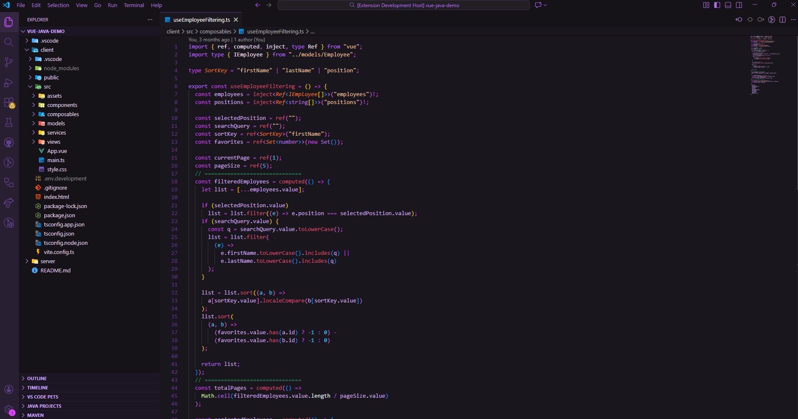
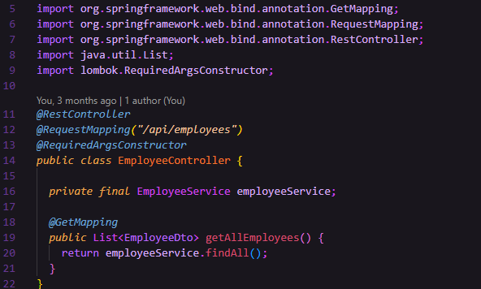

# Velvet Nebula 🔮

Velvet Nebula is a dark theme in deep purple hues, crafted for those who are drawn to the mysterious and cosmic. The color palette moves between velvety violet tones and intense nebula shades, creating a soft yet powerful visual experience.

The theme evokes a star-filled galaxy, where the interface feels like the endless depths of space—elegant, focused, and easy on the eyes during long sessions.

Launch your coding journey like a rocket into the night and let Velvet Nebula surround you with a galactic atmosphere, where every detail glows with subtle purple energy.

## ✨ Features

- 🌌 Deep, carefully balanced purple color palette

- 🚀 Designed for long coding sessions with reduced eye strain

- 🌠 Clear contrast for readability and focus

- 🪐 Subtle galactic-inspired accents and highlights

- 🎨 Consistent styling across UI elements

## 🔍 Preview

Example images:

## 💜 Feedback & Rating

If you enjoy using Velvet Nebula, consider leaving a rating and sharing your feedback. Your support helps the theme grow and reach more developers drifting through the galaxy.

Found a bug, have a suggestion, or an idea for improvement? Feel free to open an issue or start a discussion. Every piece of feedback helps refine the experience and make Velvet Nebula shine even brighter.

Thank you for being part of the journey! 🚀
